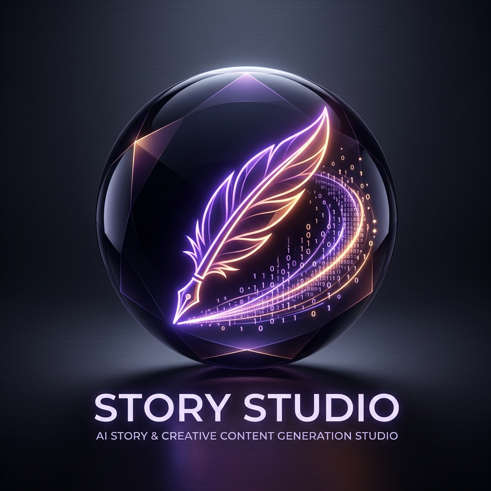

<div align="center">
  

  # STORY STUDIO 🖋️
  ### Autonomous AI Narrative Architecture & Creative Content Generation Studio

  [](https://www.python.org/)
  [](https://github.com/)
  [](https://github.com/)
  [](LICENSE)

  *Multi-agent plot synthesis · Character arc modeling · Visual prompt crafting · E-book export*
</div>

---

## 📋 Overview

**Story Studio** is a production-grade, open-source AI storytelling and creative content generation suite . Powered by autonomous LLM agent chains, Story Studio transforms high-level story concepts into fully realized multi-chapter narratives, detailed character arcs, dynamic dialogue streams, and Midjourney/SDXL visual illustration prompts.

---

## 🏛️ System Architecture

```
┌─────────────────────────────────────────────────────────────────────────────────────────┐
│                              STORY STUDIO PIPELINE ARCHITECTURE                         │
├────────────────────────────┬────────────────────────────┬───────────────────────────────┤
│     NARRATIVE PLANNING     │      CONTENT SYNTHESIS     │       EXPORT & VISUALS        │
│                            │                            │                               │
│  • Concept Intake & Genre  │  • Multi-Agent Drafter     │  • Chapter Scene Synthesizer  │
│  • 3-Act / Hero's Journey  │  • Character Memory Engine │  • Midjourney Prompt Crafting │
│  • Chapter Outline Builder │  • Dynamic Dialogue Tuning │  • E-Book PDF / Markdown Exporter
├────────────────────────────┴────────────────────────────┴───────────────────────────────┤
│                                 UNIVERSAL LLM GATEWAY                                   │
│            Ollama (Local Private)  ──►  DeepSeek  ──►  Gemini  ──►  OpenAI GPT-4o           │
└─────────────────────────────────────────────────────────────────────────────────────────┘
```

---

## 📦 Key Subsystems

### 1. 📖 Narrative Architect (`story_planner/`)
* **Structural Pacing Engine**: Supports Three-Act Structure, Hero's Journey, and episodic arcs to enforce narrative momentum and climax placement.
* **Worldbuilding Database**: Maintains lore consistency, location rules, and temporal timelines across multi-chapter sagas.

### 2. 🎭 Character & Dialogue Engine (`character_engine/`)
* **Persona & Motivation Vectors**: Tracks character flaws, desires, relationships, and voice parameters to output distinct, natural dialogue.

### 3. 🎨 Visual Prompt Engineering (`prompt_studio/`)
* **Scene-to-Prompt Translation**: Converts narrative scene descriptions into hyper-detailed image prompts tailored for Midjourney v6 and Stable Diffusion XL.

---

## ⚡ Quick Start & Usage

### Prerequisites
* **Python 3.11+**

### Installation

```bash
# 1. Clone the repository
git clone https://github.com/kartikkadam-kartykk/story-studio.git
cd story-studio

# 2. Install dependencies
pip install -r requirements.txt

# 3. Configure environment variables
cp .env.example .env
```

### Quick Execution Example

```python
from story_studio import NarrativeEngine

# Initialize storytelling engine
studio = NarrativeEngine(provider="deepseek")

# Generate a sci-fi chapter outline
story = studio.create_story(
    genre="Cyberpunk Thriller",
    premise="A rogue memory hacker uncovers an AI conspiracy in neo-Tokyo.",
    chapters=5
)

story.export_markdown("./output_story.md")
```

---

## 📜 License

This project is licensed under the **MIT License**. See the [LICENSE](LICENSE) file for details.
